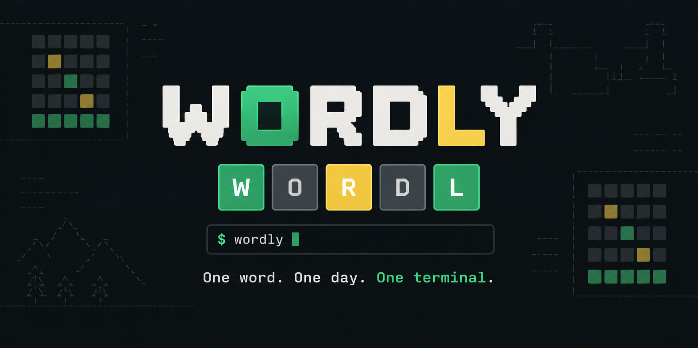
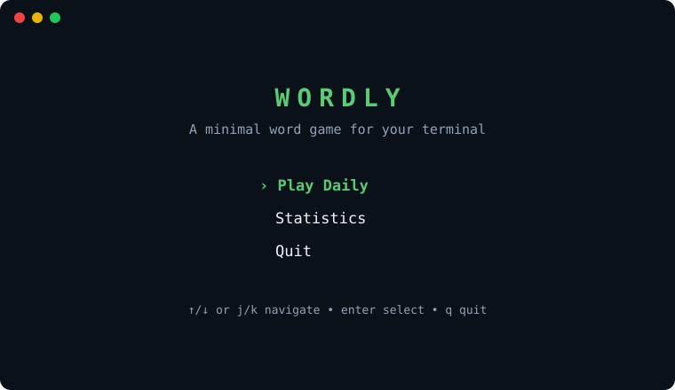
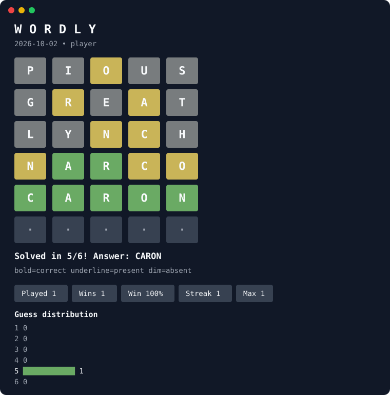
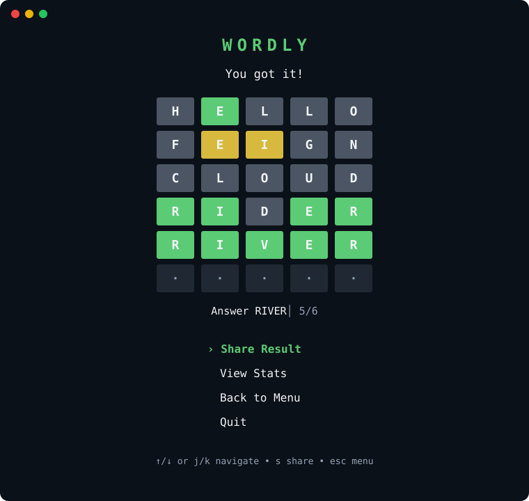
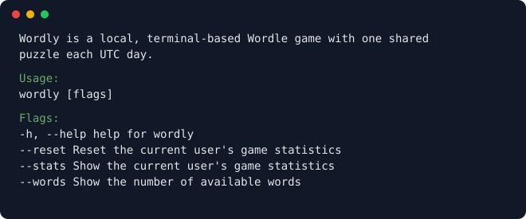
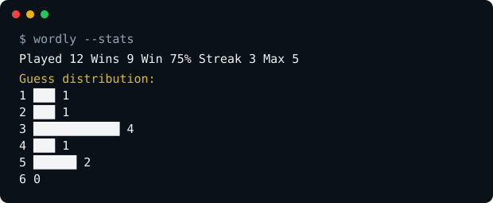
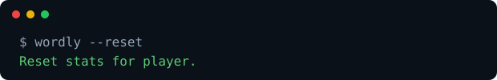

<div align="center">

# Wordly

**One shared Wordle every UTC day, played entirely in your terminal.**

[](go.mod)
[](https://github.com/nikhil25803/wordly/actions/workflows/ci.yml)
[](https://github.com/nikhil25803/wordly/releases/latest)
[](LICENSE)
[](https://github.com/charmbracelet/bubbletea)
[](https://github.com/charmbracelet/lipgloss)

</div>



## Contents

- [Overview](#overview)
- [Demo](#demo)
- [Features](#features)
- [Install](#install)
- [Commands](#commands)
- [Controls](#controls)
- [Sharing](#sharing)
- [Supported platforms](#supported-platforms)
- [Local data](#local-data)
- [Development](#development)
- [License](#license)

## Overview

Wordly is a daily, six-attempt word game for the command line. Everyone receives the same puzzle for the UTC calendar day. Accepted guesses, unfinished progress, and statistics are saved locally for the current operating-system user—there is no account, network service, or telemetry.

## Demo

<p align="center">
  <strong>Home</strong><br>
  
</p>

<p align="center">
  <strong>Daily game</strong><br>
  
</p>

<p align="center">
  <strong>Completed result</strong><br>
  
</p>

The interface adapts its board, keyboard, and statistics to the terminal width. Submitted guesses resume automatically, and reopening a finished daily game restores its complete Result screen.

## Features

- Responsive Home, Game, Result, and Statistics screens built with Bubble Tea and Lip Gloss
- Bounded large-screen layout with compact medium and small terminal variants
- On-screen QWERTY keyboard that retains the strongest feedback for every used letter
- Correct handling of repeated letters
- Dictionary validation without consuming an attempt for invalid guesses
- Automatic resume of submitted guesses and completed daily boards
- Spoiler-free result sharing through the terminal clipboard
- Daily and all-time win statistics with streaks and guess distribution
- SQLite persistence embedded with the application

## Install

### macOS, Linux, or Windows Git Bash

```sh
curl -fsSL https://raw.githubusercontent.com/nikhil25803/wordly/main/install.sh | sh
```

### Windows PowerShell

```powershell
curl.exe -fsSL https://raw.githubusercontent.com/nikhil25803/wordly/main/install.ps1 | Out-String | Invoke-Expression
```

Both installers detect the operating system and architecture, download the latest release with curl, verify its SHA-256 checksum, and install it to `~/.local/bin` by default.

To choose another directory:

```sh
curl -fsSL https://raw.githubusercontent.com/nikhil25803/wordly/main/install.sh | WORDLY_INSTALL_DIR="$HOME/bin" sh
```

```powershell
$env:WORDLY_INSTALL_DIR = "$HOME\bin"
curl.exe -fsSL https://raw.githubusercontent.com/nikhil25803/wordly/main/install.ps1 | Out-String | Invoke-Expression
```

Ensure the selected directory is on your `PATH`, then launch the game with `wordly`.

## Commands

| Command          | Purpose                                                                      | Example                                                                      |
| ---------------- | ---------------------------------------------------------------------------- | ---------------------------------------------------------------------------- |
| `wordly --help`  | Show CLI usage and available flags.                                          |         |
| `wordly --stats` | Print the current user's completed-game statistics without starting the TUI. |       |
| `wordly --words` | Print the number of words in the embedded dictionary.                        |  |
| `wordly --reset` | Delete only the current user's guesses and game history.                     |       |

`--stats`, `--words`, and `--reset` are mutually exclusive. Running `wordly` without a flag opens or resumes today's game.

## Controls

| Key             | Action                                           |
| --------------- | ------------------------------------------------ |
| Letters         | Fill the current five-letter guess               |
| Backspace       | Remove the last letter                            |
| Arrow keys, j/k | Navigate menus                                   |
| Enter           | Submit a guess or select a menu item              |
| S               | Copy a completed result from the Result screen    |
| Esc             | Return to the previous screen                     |
| Ctrl+C          | Quit while preserving submitted guesses          |

Correct letters are **bold and green**, present letters are <u>underlined and yellow</u>, and absent letters are dim and gray. The legend remains visible so meaning is not conveyed by color alone.

## Sharing

From the completed Result screen, select **Share Result** or press `s`. Wordly copies a spoiler-free grid using the UTC puzzle date and number of attempts:

```text
WORDLY 2026-10-06 5/6

⬛🟩⬛⬛⬛
⬛🟨🟨⬛⬛
⬛⬛⬛⬛⬛
🟩🟩⬛🟩🟩
🟩🟩🟩🟩🟩

I played today's Wordly — can you solve it too?
https://github.com/nikhil25803/wordly
```

Clipboard copying uses OSC52, supported by most modern terminals.

## Supported platforms

| Operating system | Architectures | Archive   | Installer              |
| ---------------- | ------------- | --------- | ---------------------- |
| Linux            | amd64, arm64  | `.tar.gz` | POSIX shell            |
| macOS            | amd64, arm64  | `.tar.gz` | POSIX shell            |
| Windows          | amd64, arm64  | `.zip`    | PowerShell or Git Bash |

## Local data

Wordly stores one SQLite database in the operating system's user configuration directory:

| Platform | Default location                                                    |
| -------- | ------------------------------------------------------------------- |
| Linux    | `$XDG_CONFIG_HOME/wordly/wordly.db` or `~/.config/wordly/wordly.db` |
| macOS    | `~/Library/Application Support/wordly/wordly.db`                    |
| Windows  | `%AppData%\wordly\wordly.db`                                        |

`wordly --reset` removes the current user's gameplay records while preserving the user registration, dictionary, and daily puzzles.

## Development

Wordly requires the Go version declared in [go.mod](go.mod).

```sh
go test ./...
go test -race ./...
go vet ./...
go run ./cmd/wordly
```

## License

Wordly is available under the [MIT License](LICENSE).
